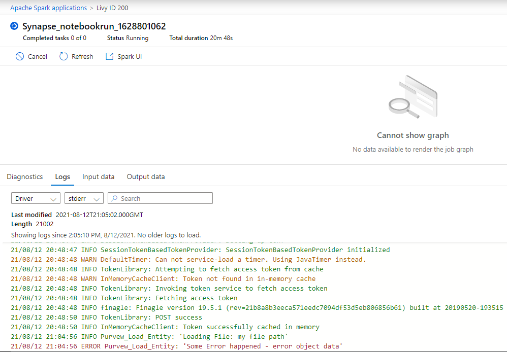

# Troubleshooting
This document includes a list of known issues experienced by users of the Solution Accelerator. Please feel free to add any other issues as [contributions](./CONTRIBUTING.md) to this repository

## Logging

The code in the Solution Accelerator is Python and is run within a Synapse Spark Pool. Application logging is implemented to allow for integration with Spark logging. The solution uses the Apache Spark Log4j library. Custom logging can be added to notebooks using the log_msgs function. In the bottom pane, click on "Logs" and check that you are viewing the stderr logs from the Driver. Custom logging is integrated into this report.

### Viewing Logs

To view the custom logs, you can pull up the Spark logs from within the monitoring pane.  Just click on "Monitor" from the left pane in the Synapse workspace, then click on "Apache Spark applications". Drill into the application of interest. Search for the app name defined in the notebooks logging code (e.g. Purview_load_entity)

## Known Issues

Subject | Issue | Resolution
---------|---------|----------
 Deployment - Base Services| InvalidTemplateDeployment when running purview_connector_services deployment script (deploy_sa.sh) | This error may be due to resource quota violations.  Try running again in a different location.
 Deployment - Base Services | LocationNotAvailableForResourceType | Purview is available in eastus, westeurope, southeastasia,canadacentral, southcentralus, brazilsouth, centralindia,uksouth, australiaeast, eastus2
 Deployment | line 2: $'\r': command not found errors | change from crlf to lf for script file in code and then save
 Deployment | argument --value: expected one argument when adding keyvault secret | Make sure you have saved the settings.sh file after modification
 Deployment | Unexpected transient failures | The deployment scripts can be run multiple times without issue.  If you get a transient failure, you can try running the deployment script again
 Deployment - Base Services | ERROR: (ClientIpAddressNotAuthorized) Client Ip address : x.x.x.x - before installing Synapse Linked Service | Check to see if the linked service was installed. This service must be installed in order to import pipelines from the examples. Run the linked service install code again manually. This is an intermittent error from Azure. The line to install linked services is in purview_connector_services/deploy/deploy_sa.sh Line 87 - 94. You can run the relevant script after filling in variables, or just delete and retry the installation. You will need the storage account and synapse account names. Hint: The export_names.sh file contains all the service names and other metadata for use in example installs. You can populate all these variables at the command line by running 'source export_names.sh'
 Deployment | Tenant x with x accounts has surpassed its resource quota for x location | Ctrl+'C' to cancel the install, pick another available location from the following: eastus, westeurope, southeastasia,canadacentral, southcentralus, brazilsouth, centralindia,uksouth, australiaeast, eastus2. Modify the settings.sh file accordingly
 Deployment - SSIS example | Allocation failed. We do not have sufficient capacity for the requested VM size in this region | Try modifying the VM ARM template to another VM size and rerun the deploy_ssis.sh script. Alternatively, deploy a SQL Server VM of a different size through the portal. You will need to fill in the VM public IP where needed in pipeline parameters as this will not be filled in automatically.
 Pipeline Run | Notebook fails immediately with "Object reference not set to an instance of an object." | Go to the notebook view in Synapse Workspace and make sure the notebook that failed is configured to use a Spark Pool.
