# Overview of the SSIS example

As described in the [Readme.md](../../README.md#connector-development-process) document, the development steps for creating any connector can be divided into the following categories:

1. Locate and pull meta-data
2. Define the meta-model
3. Parse / transform the meta-data
4. Ingest the meta-data into Purview

## Pull SSIS Meta-data

The first step in creating a custom connector is locating the target source metadata, and methods for retrieving this data programatically. SSIS metadata is primarily contained within a project ispac file which is exportable from the SQL Server on which SSIS in installed.  This file is actually a zip based archive and contains the following files:

* **@Project_manifest**
  * This file includes information about the authoring of the package as well as parameters, server info, etc.
* **Connection manager files (conmgr extension)**
  * These files detail connections defined for the package, containing connection types, paths, etc. Server names and connetion information is overwritten by package configuration parameters in our scenario.
* **Package files (dtsx extension)**
  * XML file containing all of the details about the SSIS job. The large majority of the meta-data is contained in this file.

Other files are not used for meta-data extraction in this example, but files like Project.params would be useful in situations where parameters were assigned at the project level.
In our scenario, we are using package level parameters which are defined by configuring the dtsx package.  These parameters are dynamic and not available as part of the exported package data. Values for these parameters must be retrieved from the SSISDB database. The SQL query and code for this retrieval is contained in the SSISDB_Get_Params notebook.

In order to export the SSIS package programmatically, the exporting code needs to authenticate to the SQL Server using Windows Authentication. This causes issues when trying to authenticate outside of the domain / network of the VM. In order to log on locally, the accelerator uses Azure Automation combined with Log Analytics to create a [hybrid runbook](https://docs.microsoft.com/en-us/azure/automation/automation-hybrid-runbook-worker) which will run locally on the VM, using the log analytics agent. This hybrid runbook is analogous to the self-hosted integration runtime (SHIR) component which retrieves meta-data for supported, on-premises sources.

## Define the SSIS Meta-model

Developing a meta-model for SSIS is helped by the fact that Purview does support SSIS when implemented through Azure Data Factory.  This means that there are already existing types built into Purview which can be cloned to create the on-prem SSIS meta-model. Instructions for cloning these types using the [Purview Custom Types Tool](https://github.com/microsoft/Purview-Custom-Types-Tool-Solution-Accelerator) are included as part of the "Running the Solution" section below. Examples from the ADF implementation are included in the ./meta-model/adf directory.

## Parsing the SSIS Package

The main source of meta-data for the SSIS project is the SSIS package file (dtsx). This xml file contains all the information about the data transfer, column names, etc. To make it easier to parse this file, it is translated into json format as part of the pipeline processing. From there, meta-data is extracted as needed to fill in the Purview entity templates which are modifications of those created by the Purview Custom Types tool. These templates can be viewed in the ssis/meta_model/example_templates directory.
One of the critical translations is from the name of the SSIS source or target to a qualified name for that source or target within Purview. Purview treats these qualified names as unique and it is very possible that the entities contained in the SSIS package already have representation in Purview if those sources have been scanned. For example, in our simple package we are using an ADLS csv file as a source. if that ADLS storage has already been scanned by Purview, it is necessary to make sure that the SSIS source csv is recognized as the same source entity as the ADLS csv which Purview has scanned. This requires carful creation of Purview qualified names from the SSIS source target names in the package.
Support has been built into the Purview Connector Services to create a dummy entity to represent sources or targets of SSIS packages that do not exist in Puview, and to delete and map these to sources that do exist if they are scanned into Purview at a later time. For details, see the [Purview Connector Services](../../purview_connector_services/purview_connector_services.md) documentation.

## Overview of the ingestion / parsing pipeline

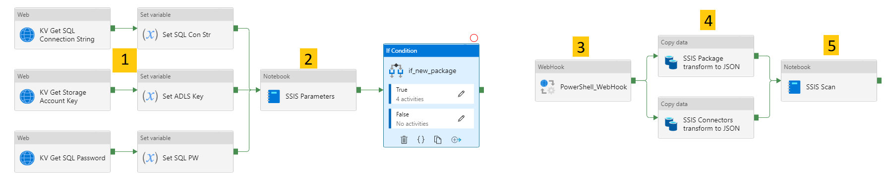

1. Retrieve the SQL Connection String, Storage Account Key, and SQL Password from KeyVault, and read them into the pipeline variables.
2. Run the SISSDB_Get_Params notebook which does the following
    1. Queries the SSISDB database to get the last execution ID
    2. Compares this value against a stored execution ID value.  If the package has not been executed since the last scan, returns false and exits the notebook
    3. If the SSIS package has been run since last scan, pulls the parameters for the package from the SSISDB and copies them to storage
    4. Returns true to continue running the rest of the pipeline
3. Run the PowerShell_WebHook task which triggers a Hybrid Runbook (defined in the Azure Automation Service) to be run locally on the SQL Server VM. The PowerShell Script is deployed from ssis/scripts/powershell_loop_script.ps1. This script:
    1. Exports the target SSIS package(s)
    2. Extracts the package and copies the resulting files into blob storage under pccsa_main/ssis-connector/ssis-package
4. Transform the XML SSIS package and connectors information to JSON to make it easier to work with programmatically in Python
5. Run the SSIS_Scan_Package notebook to:
   1. parse the JSON files and transform them into the Purview types
   2. Copy the resulting entity data into the pccsa_main/incoming directory in blob storage

## Running the Example Solution

### Follow the instructions for deploying the prerequisites, base service, and SSIS example

### Configure and run the SSIS package on the VM

* RDP into the SQL VM and start SQL Server Management Studio
* In the Object Explorer, navigate to the PurviewSSISTest project, right click on it and choose 'Configure...'
  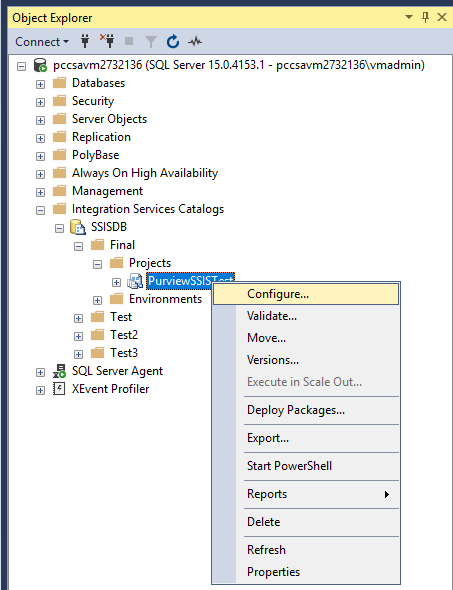
* In configuration properties, select the 'Connection Managers' tab
* Configure the following to match your installation for the ADLS Connection
  * AccountKey - Azure Storage Account Key
  * AccountName - Azure Storage Account Name
  * ConnectionString - IMPORTANT: Copy the existing string and modify only the account name
  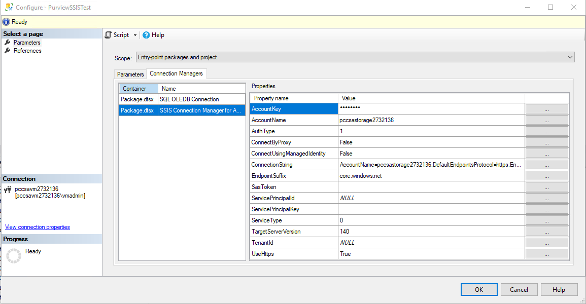
* Switch to the SQL OLEDB Configuration and Configure the following to match your installation
  * Password - SQL password (from deployment script settings file)
  * ServerName - SQL VM DNS name or IP
  * ConnectionString - IMPORTANT: Copy the existing string and modify only the SQL name or IP
  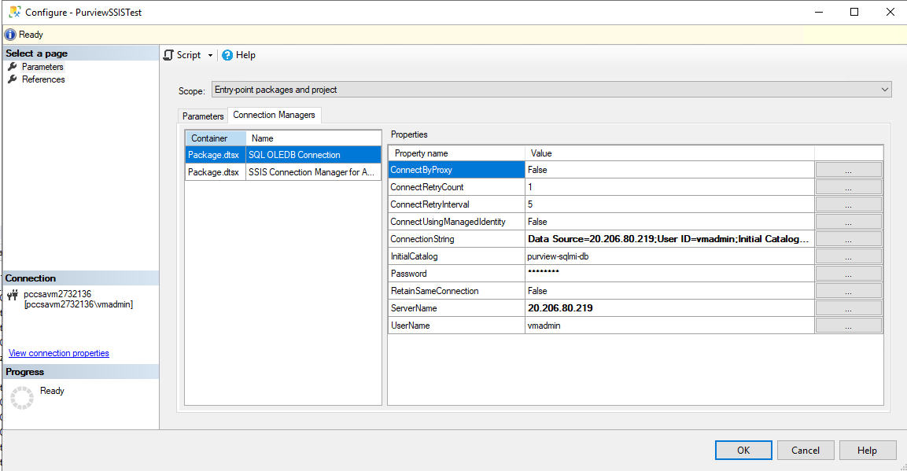
* Right click the project again and choose 'Validate...'
* Navigate to Package.dtsx under the PurviewSSISTest project, right click it and choose 'Execute...'
* Choose 'Yes' to view the report and ensure that the job ran successfully. You should now have data in the purview-sqlmi-db/dbo.MovCustomers table

### Create types in Purview

For general Atlas type information review the resource list in [README.MD](../../README.MD#purview-development-resources)

* After configuring and starting the Purview Custom Types tool, you will be presented with a drop down allowing you to create a new service type (think of this like a grouping of all the types for a particular connector project), or a view of all types. Since we will be cloning existing SSIS types, choose 'All Type Definitions'
  
* Choose 'Entity Defs' on the left pane to see all of the main entity definition types. Press Ctrl+'F' to find types containing 'SSIS' in the type name. Locate and select the ssis_package type

  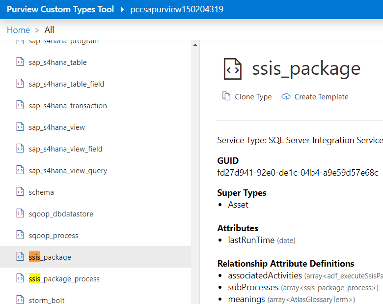

* Choose the option to clone the type

  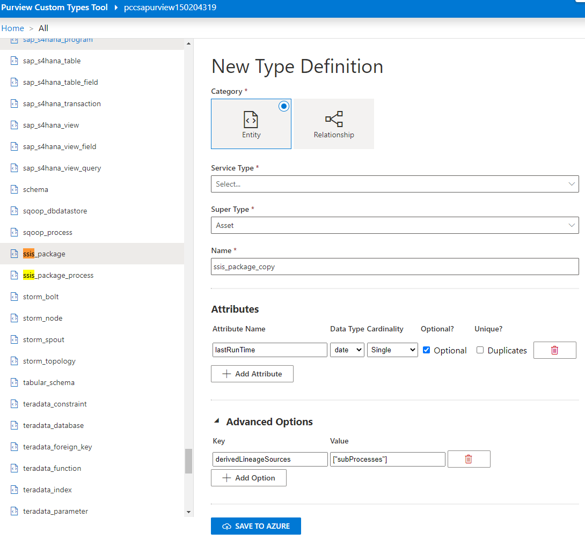

* In the 'Service Type' dropdown, choose the option to 'Create New Service Type' and name the new service type legacy_ssis
Rename the type from ssis_package_copy to legacy_ssis_package and choose the option to save it to Azure (saves the type to Purview)

  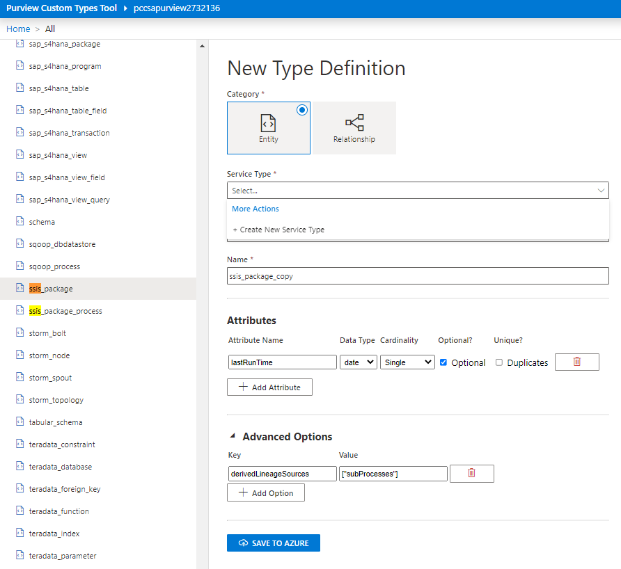

* Repeat these steps to clone the ssis_package_process type to legacy_ssis_package_process, also under the legacy_ssis service type
* In the left pane, collapse 'Entity Def' list and expand the 'Relationship Defs' list

  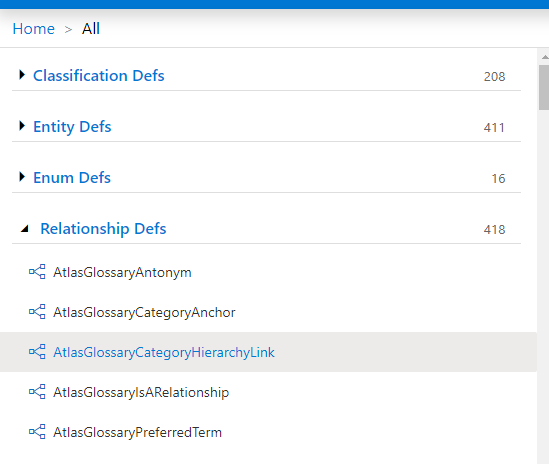

* Use the find functionality to search again on 'ssis' and locate the ssis_package_process_parent relationship type. This relationship type defines the relationship between the ssis types, and defines the inputs and outputs necessary for lineage creation. Clone and rename this type to purview also under the legacy_ssis service type.
* Select the legacy_ssis_package_process type in the dropdown next to EndDef1
* Select the legacy_ssis_package type in the dropdown next to EndDef2
* Save the type to Purview

  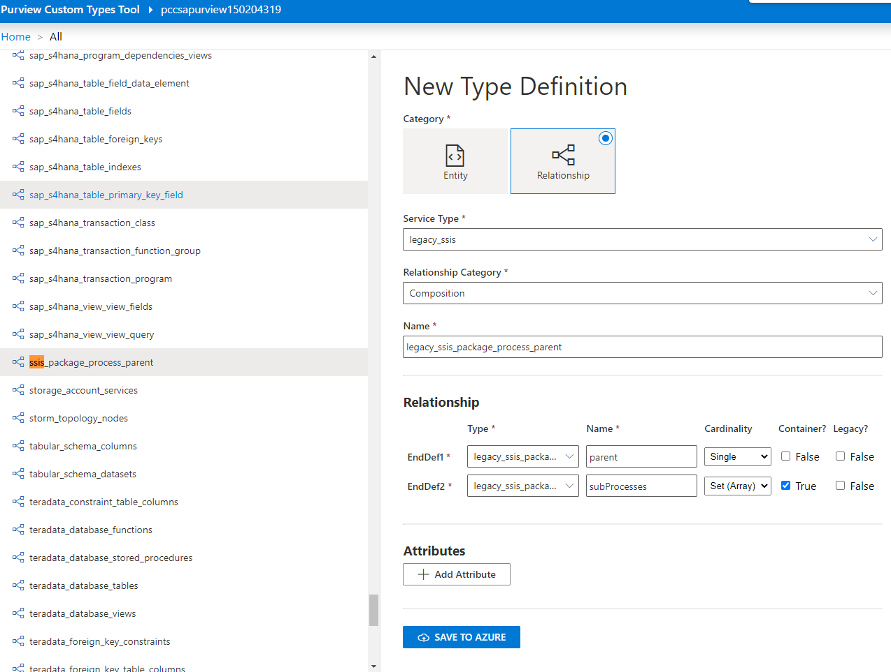

* In the upper left of the interface, select 'Home' - you will be presented again with the initial drop down
* This time choose to view the 'legacy_ssis' service types
* For each of the two entity types you just created, select them and choose the "create template" option

  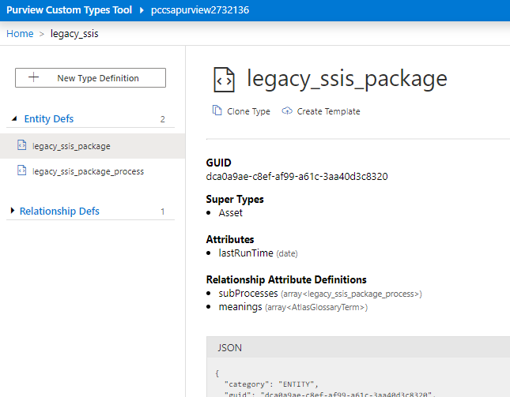

* The Custom Type Tool will create templates in blob storage under 'custom-typedefs'. These templates are modified to form the final templates used for transformation to Purview types in the pipeline

### Run the SSIS Pipeline

* In Synapse Analytics Workspace, navigate to the SSIS_Package_Pipeline. All parameters and variables should be preconfigured. You can click on the pipeline background and choose the Parameters tab to examine the values

  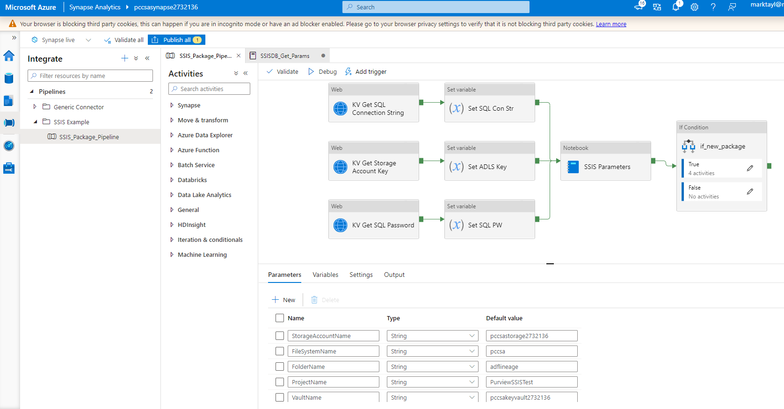

* Start SSIS pipeline by triggering it, or pressing the debug button. Note that the pipeline run can easily be triggered on a schedule allowing for periodic updating of any changes to the SSIS activity
* Examine the results for each pipeline activity

### View Results in Purview

* Once the pipeline completes, it will copy the entity data to the incoming folder in blob storage, this will activate the Purview Load Custom Types Pipeline to ingest the data into Purview
* Open Purview Studio and search for the newly created lineage for the legacy SSIS job

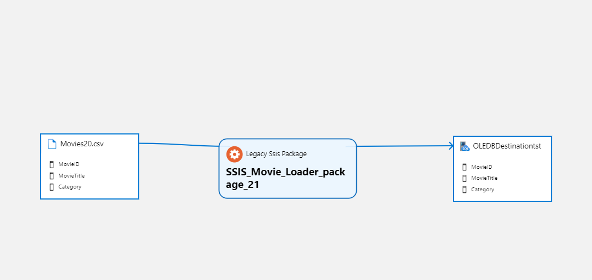
