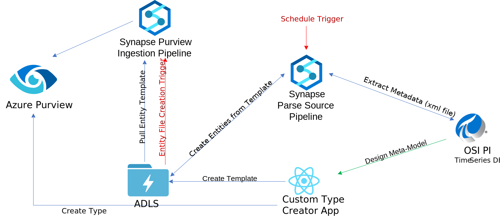
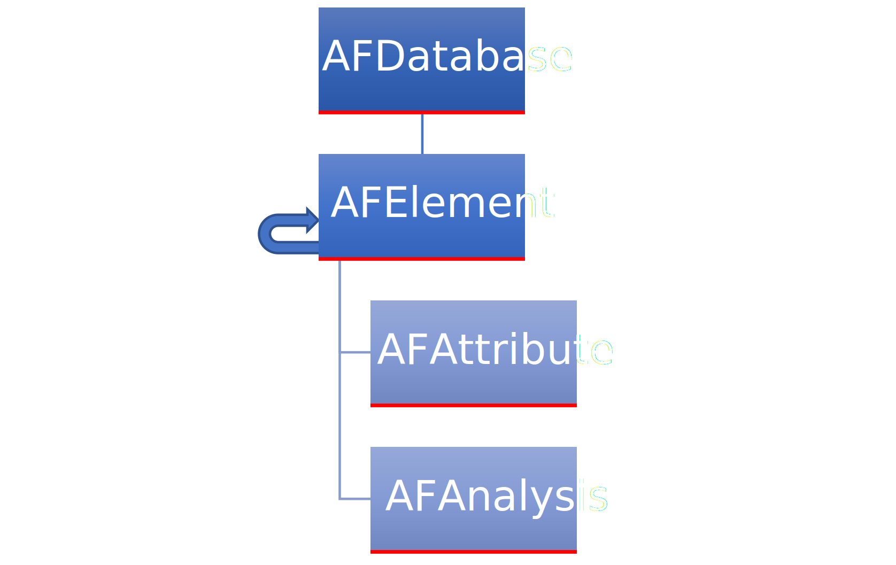
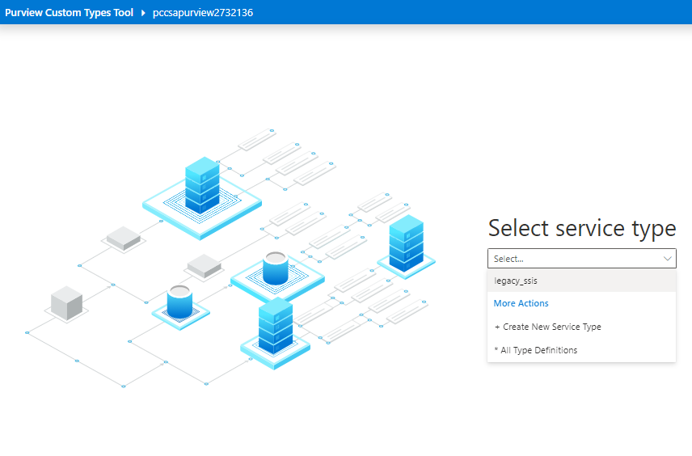
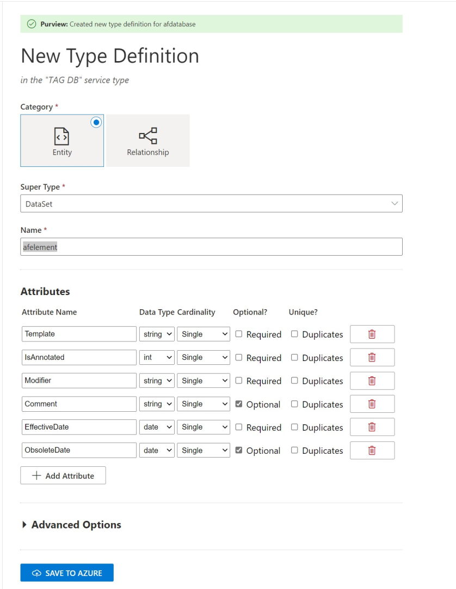
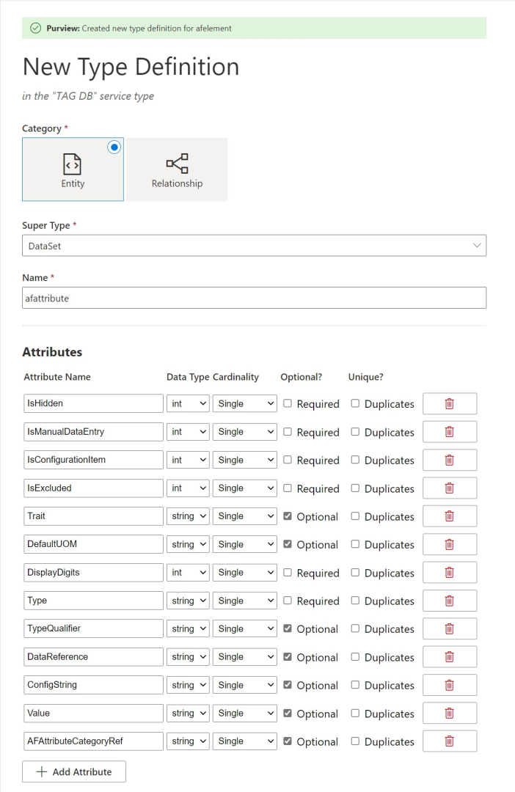
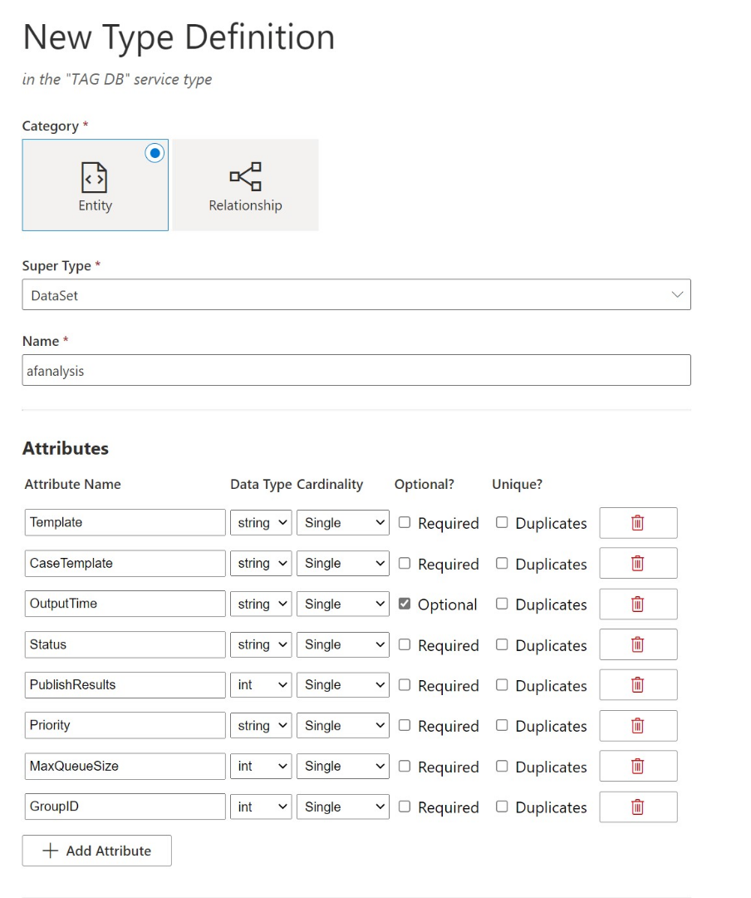
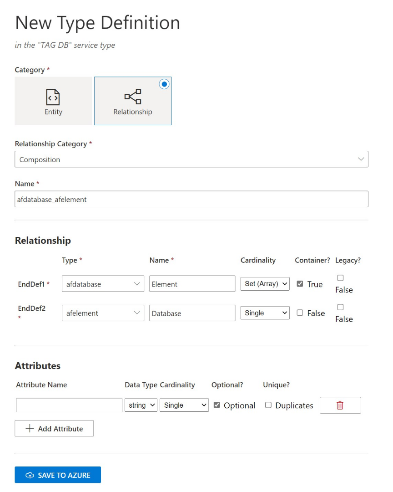
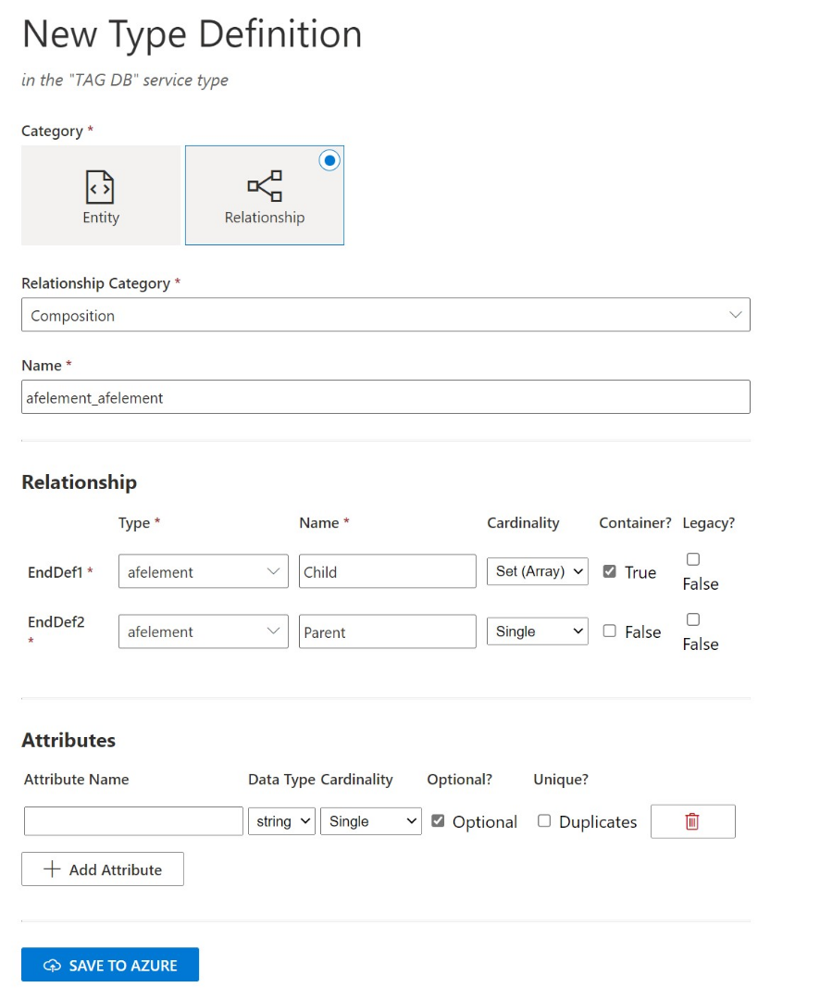
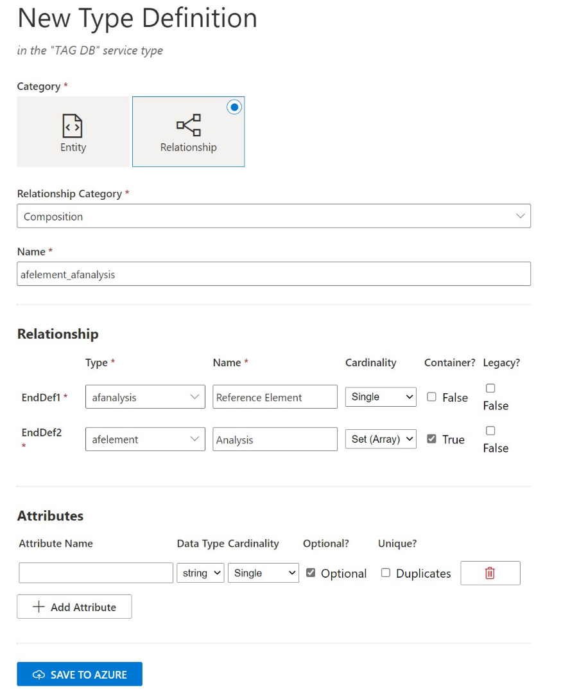

# Tag DB Custom Connector

This Sample will allow you to scan TAG DB metadata, exported from the TAG DB API. With some small changes you should be able to use the TAG DB SDK to direcly connect to the TAG DB and extract in real time. With this sample you will be able to:

- Read TAG DB Metadata XML file and trransform into json
- Load into a folder to be processed by [Purview Custom Connector Solution Accelerator](https://github.com/microsoft/Purview-Custom-Connector-Solution-Accelerator), to be uploaded to Purview Catalog
- Monitor the process end to end
- Automate the metadata capture
  - Scheduling
  - Triggered by File event

## Pull Tag DB Meta-data

You should be able to export TAG DB metadata way to export Metadata from TAG DB Server (xml format)

## Define the Tag DB Meta-model

The TAG DB module was design following the hierarchical structure of the tags it is composed by:

1. AFDatabase - it is the root and has one or more AFElement
    1. AFElement - Has relationship with multiples AFElement
        1. AFAttribute
        2. AFAnalysis

## Running the Example Solution

### Prerequisites

To use this custom connector you will need to deploy the complete 'Purview Custom Connector Solution Accelerator' and 'Purview-Custom-Types-Tool-Solution-Accelerator-main' that will allow you to create the Entity definition for TAG DB, also you will need a process that exports TAG DB metadata xml file.

### Step 1. Configure Pipeline Parameters

1. Deploy the 'Purview Custom Connector Solution Accelerator'. [Deploy Solution](../../purview_connector_services/deploy/deploy_sa.md)
2. Deploy the 'Purview Custom Types Tool Solution Accelerator' [Deploy Solution](https://github.com/microsoft/Purview-Custom-Types-Tool-Solution-Accelerator)
3. Deploy the 'TAG DB Connector'. [Deploy Solution](deploy/deploy_tag_db.md)

### 2. Configure Development Environment

1.Folder structure:

<!---->

    1.1 'tag-db-xml' - Location of the xml file exported from the TAG DB that will be used to load the tag db metadata into Azure Purview
    1.2 'tag-db-json' - Location where will be generated the conversion of the xml into a json format to be used to load meta data into Azure Purview
    1.3 'tag-db-purview-json' - Location where the 'TAG DB Scanner' generate the json file to be loaded int o operview
    1.4 'tag-db-proccessed' - Loacation where all files processed by 'TAG DB Scanner' will put all files processed by the solution. 

### Create types in Purview

For general Atlas type information review the resource list in [README.MD](../../README.MD#purview-development-resources)

* After configuring and starting the Purview Custom Types tool, you will be presented with a drop down allowing you to create a new service type (think of this like a grouping of all the types for a particular connector project), or a view of all types. We wil be creating new types for TAG DB, let select 'Create New Service Type' and on the next screen name it 'TAG DB'
  
* In the 'New Type Definition' Screen:
    * Select 'Category' as Entity.
        * Super Type = Dataset
        * Name = 'afdatabase'
        * Attibutes:
        
| Attribute Name    | Data Type | Cardinality  | Optional?    | Unique? |
| :---------------- | :-------- | :----------- | :----------- | :------ |
| DefaultPIServer   | string    | Single       | not Optional | Unique  |
| DefaultPIServerID | string    | Single       | not Optional | Unique  |

* Save to Azure

* In the 'New Type Definition' Screen:
    * Select 'Category' as Entity.
        * Super Type = Dataset
        * Name = 'afelement'
        * Attibutes:

| Attribute Name    | Data Type | Cardinality  | Optional?    | Unique? |
| :---------------- | :-------- | :----------- | :----------- | :------ |
| Template          | string    | Single       | is Optional  | Unique  |
| IsAnnotated       | string    | Single       | is Optional  | Unique  |
| Modifier          | string    | Single       | is Optional  | Unique  |
| Comment           | string    | Single       | is Optional  | Unique  |
| EffectiveDate     | string    | Single       | is Optional  | Unique  |
| ObsoleteDate      | date      | Single       | is Optional  | Unique  |

* Save to Azure

* In the 'New Type Definition' Screen:
    * Select 'Category' as Entity.
        * Super Type = Dataset
        * Name = 'afattribute'
        * Attibutes:

| Attribute Name         | Data Type | Cardinality  | Optional?    | Unique? |
| :--------------------- | :-------- | :----------- | :----------- | :------ |
| IsHidden               | int       | Single       | not Optional | Unique  |
| IsManualDataEntry      | int       | Single       | not Optional | Unique  |
| IsConfigurationItem    | int       | Single       | not Optional | Unique  |
| IsExcluded             | int       | Single       | not Optional | Unique  |
| Trait                  | string    | Single       | is Optional  | Unique  |
| DefaultUOM             | string    | Single       | is Optional  | Unique  |
| DisplayDigits          | int       | Single       | not Optional | Unique  |
| Type                   | string    | Single       | is Optional  | Unique  |
| TypeQualifier          | string    | Single       | is Optional  | Unique  |
| DataReference          | string    | Single       | is Optional  | Unique  |
| ConfigString           | string    | Single       | is Optional  | Unique  |
| Value                  | string    | Single       | is Optional  | Unique  |
| AFAttributeCategoryRef | string    | Single       | is Optional  | Unique  |

* In the 'New Type Definition' Screen:
    * Select 'Category' as Entity.
        * Super Type = Dataset
        * Name = 'afanalysis'
        * Attibutes:

| Attribute Name         | Data Type | Cardinality  | Optional?    | Unique? |
| :--------------------- | :-------- | :----------- | :----------- | :------ |
| Template               | string    | Single       | not Optional | Unique  |
| CaseTemplate           | string    | Single       | not Optional | Unique  |
| OutputTime             | string    | Single       | is Optional  | Unique  |
| Status                 | string    | Single       | not Optional | Unique  |
| PublishResults         | int       | Single       | not Optional | Unique  |
| Priority               | string    | Single       | not Optional | Unique  |
| MaxQueueSize           | int       | Single       | not Optional | Unique  |
| GroupID                | int       | Single       | not Optional | Unique  |

* In the 'New Type Definition' Screen:
    * Select 'Category' as Relationship:
        * Relationship Category = Composition
        * Name = 'afdatabase_afelement'
        * Relationship:
  
 | Type         | Name      | Cardinality  | Container?   | Legacy? |
 | :----------- | :-------- | :----------- | :----------- | :------ |
 | afdatabase   | Element   | Set          | true         | false   |
 | afelement    | Database  | Single       | false         | false  |

* In the 'New Type Definition' Screen:
    * Select 'Category' as Relationship:
        * Relationship Category = Composition
        * Name = 'afelement_afelement'
        * Relationship:
  
 | Type         | Name      | Cardinality  | Container?   | Legacy? |
 | :----------- | :-------- | :----------- | :----------- | :------ |
 | afelement    | Child     | Set          | true         | false   |
 | afelement    | Parent    | Single       | false        | false   |

* In the 'New Type Definition' Screen:
    * Select 'Category' as Relationship:
        * Relationship Category = Composition
        * Name = 'afelement_afattribute'
        * Relationship:
  
 | Type         | Name           | Cardinality  | Container?   | Legacy? |
 | :----------- | :------------- | :----------- | :----------- | :------ |
 | afattribute  | Parent Element | Single       | false        | false   |
 | afelement    | Attribute      | Set          | true         | false   |

* In the 'New Type Definition' Screen:
    * Select 'Category' as Relationship:
        * Relationship Category = Composition
        * Name = 'afelement_afanalysis'
        * Relationship:
  
 | Type         | Name              | Cardinality  | Container?   | Legacy? |
 | :----------- | :---------------- | :----------- | :----------- | :------ |
 | afanalysis   | Reference Element | Single       | false        | false   |
 | afelement    | Analysis          | Set          | true         | false   |

- The file xml sample metadata from TAG DB [tag-db-xml-sample.xml](./files/tag-db-xml-sample.xml)
