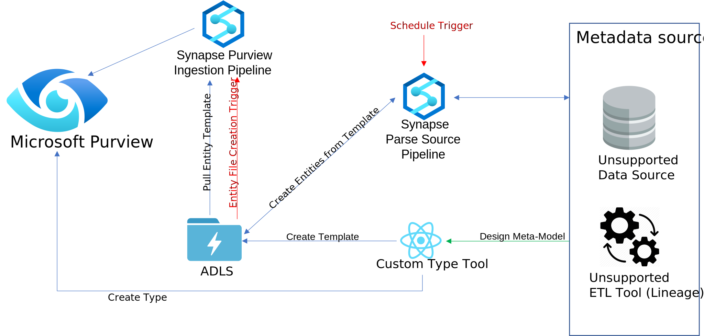
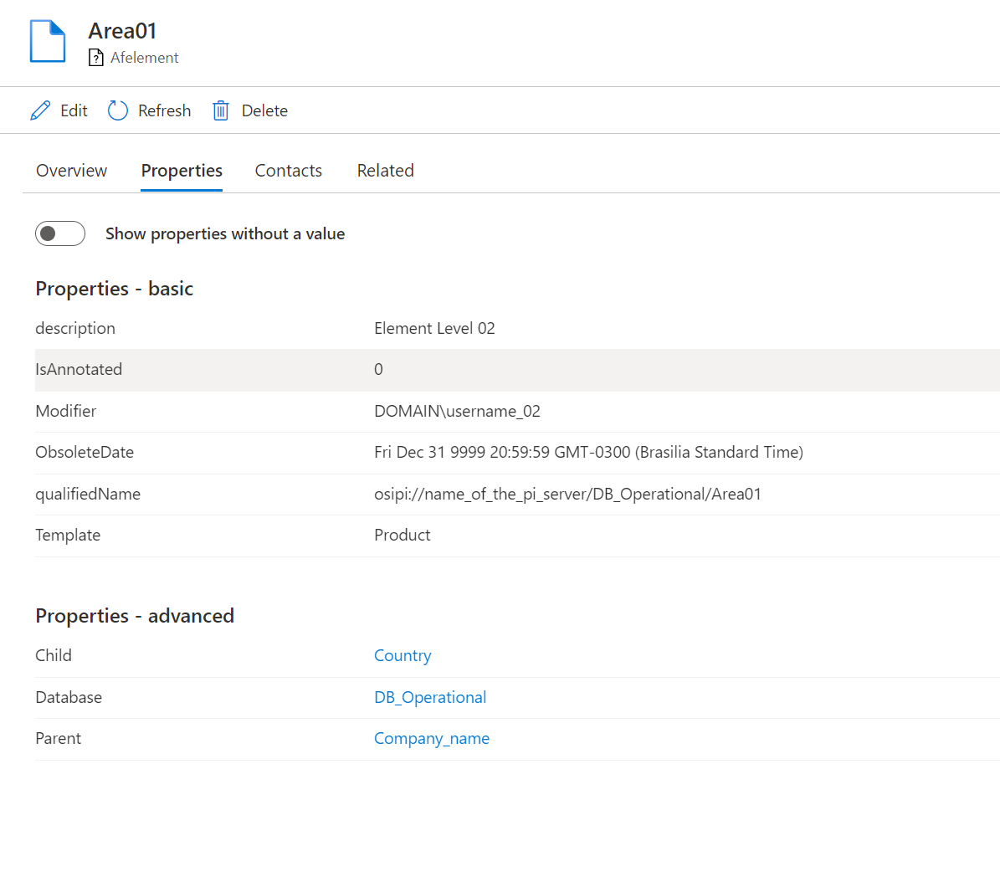
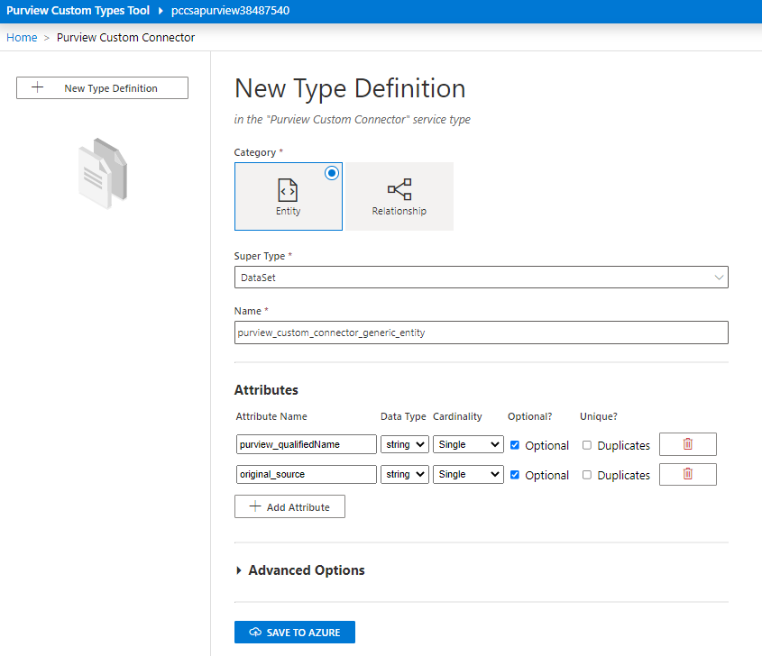
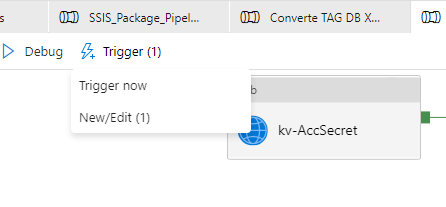
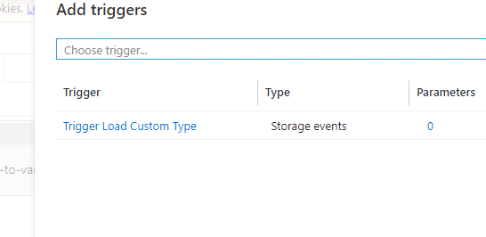
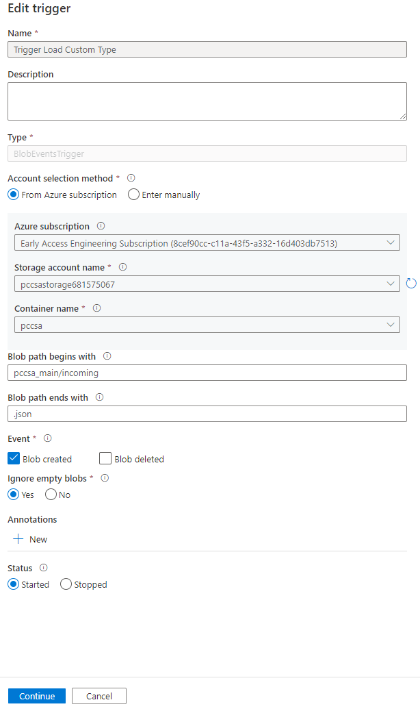

# Purview Connector Services

The Purview Connector Services are reusable services to convert templates partially generated by the Purview Custom Type Tool into entities in Purview

## Infrastructure Design

Services are implemented in the Purview_Load_Entity_Json notebook and are based on the PyApacheAtlas Python library

The notebook is run from the Purview Load Custom Types pipeline which is triggered when entity definitions are created in blob storage (for example by the SSIS pipeline). The trigger looks for files created in the pccsa_main/incoming directory

Processed entity definition files are delivered to the pccsa_main/outgoing directory

## Features

* The Purview Connector Services provide intelligent processing / ingestion of template types including:
  * Translation of qualified names into Purview entities with associated unique identifiers (GUIDs)
  * Creation of dummy types for lineage when sources appear in ETL activities which are not yet scanned
  * Coordination of dummy types with newly scanned types - allowing for the deletion of dummy types when the source in the lineage relationship is scanned and actual entities become available

_Purview SISS lineage example_

_Purview Tag DB example_

## Running the solution

The connector services are the foundation of this accelerator. Connectors will re use these services to connect and ingest data into Purview. The connector does not run until the examples are installed, but there are some steps necessary to configure the connector for use.

### Create Generic Type

Using the Purview Custom Types Tool configured and installed using the steps in deploy_sa.md

* Create a new Service Type Called 'Purview Custom Connector' then select that service type to enter the type creation experience.

* Choose 'New Type Definition' and then fill in the resulting dialog as shown below. 'Save to Azure' when done

### Configure Pipeline Trigger

If you would like to trigger the pipeline based on incoming entity data, you need to enable it and then publish the change. This will trigger when files are added to the pccsa_main/incoming storage location

* Go to the pipelines view in the Generic Connector pipeline. Click on Trigger and then New/Edit

* Select the 'Trigger Load Custom Type' trigger to edit

* At the bottom of the screen change the status to 'started' and then press 'continue'

