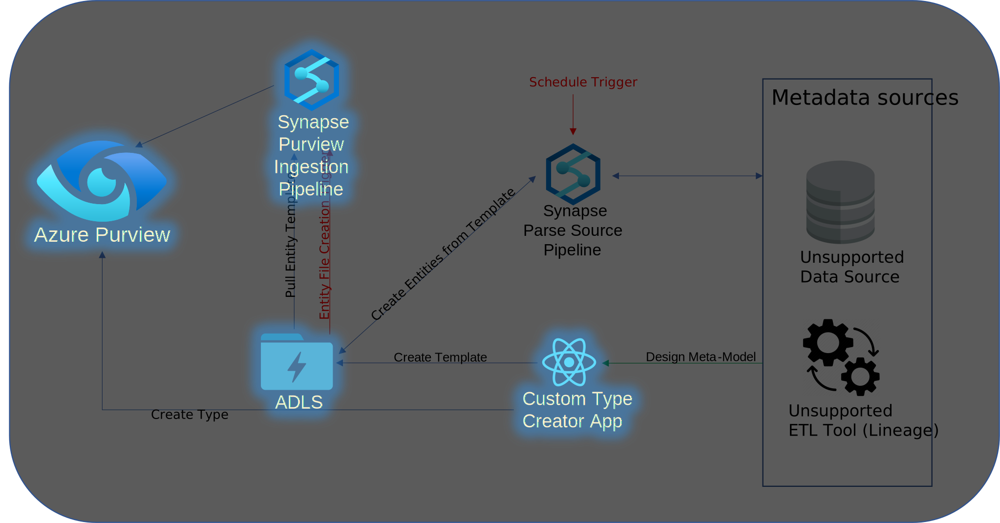
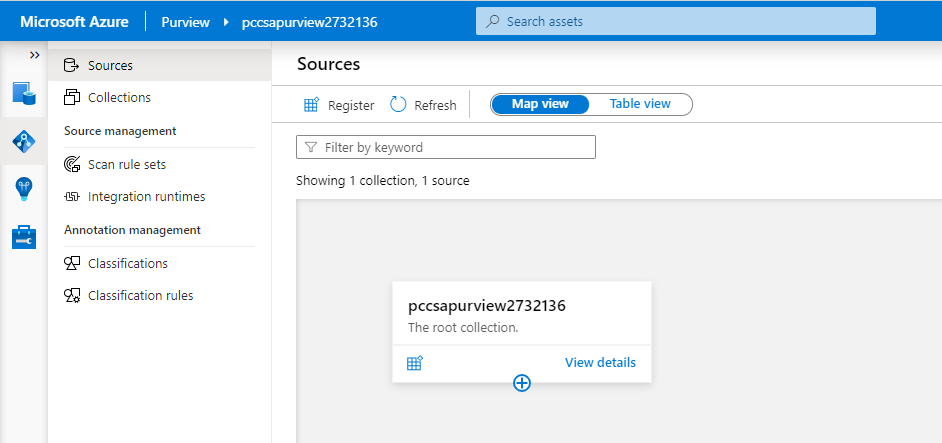
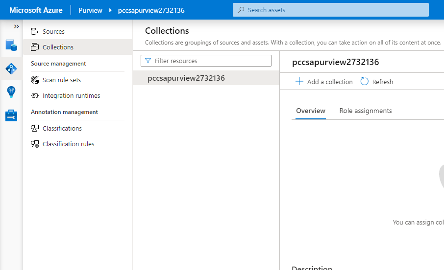
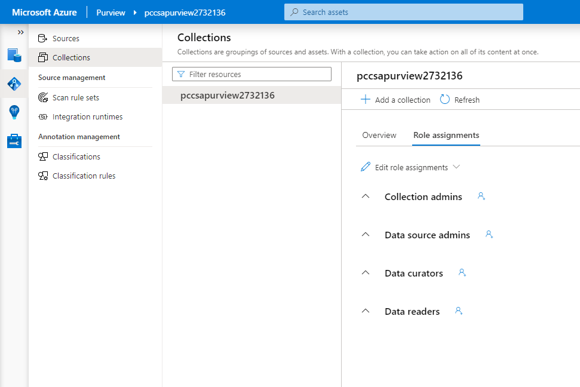

# Deployment of the Purview Custom Connector Solution Accelerator Base Services

## Services Installed
  
  

## Deployment Steps

### Create an application identity and corresponding secret

 This will be the identity used for access to the Purview workspace from the Custom Type Tool application and from the synapse connector services. See [Create a service principal](https://docs.microsoft.com/en-us/azure/purview/tutorial-using-rest-apis#create-a-service-principal-application)

### Clone the repository into Azure cloud shell

* Start the cloud CLI in bash mode
* cd to the cloud storage directory (clouddrive)
* clone this repository into the clouddrive directory

```bash
git clone https://github.com/microsoft/Purview-Custom-Connector-Solution-Accelerator.git

```  

### Configure application settings file

* Download the settings.sh.rename file from the Purview-Custom-Connector-Solution-Accelerator/purview_connector_services/deploy directory
* Modify the file as indicated to include a setup location, App name, client id, and secret
* Rename the file to settings.sh

### Upload the application settings

* Upload the settings.sh file (created above) to the deploy directory using the Upload/Download files tool

  

* Choose the "Manage file share" option, navigate to the Purview-Custom-Connector-Solution-Accelerator/purview_connector_services/deploy directory and copy the settings.sh file into this directory

  

  

### Run the deployment script

* Navigate to the Purview-Custom-Connector-Solution-Accelerator/purview_connector_services/deploy directory
* Run the deploy_sa.sh script

```bash
./deploy_sa.sh

```

  For details about the scripts functionality, see [Reference - script actions](#reference---script-actions)

### [Configure your Purview catalog to trust the service principal](https://docs.microsoft.com/en-us/azure/purview/tutorial-using-rest-apis#configure-your-catalog-to-trust-the-service-principal-application)

* Open Purview Studio and select the Data Map icon in the left bar

  

* Choose the "View Details" link on the root collection

  

* Click on the 'Role assignments' tab in the root collection pane

  

* Click on the icon next to the role name and add the application identity you created above to the following roles:
  * Data curators
  * Data readers

### Install the [Purview Custom Types Tool](https://github.com/microsoft/Purview-Custom-Types-Tool-Solution-Accelerator)

* Follow the instructions in the project readme file  
* You will need the app identity and secret you created above as well as information from the installed Purview service
* **_Note: If you are installing Node, be sure to install the LTS branch (v 14) NOT the latest (v 16)_**

## Reference - script actions

* Create resource group
* Deploy KeyVault
  * Save client secret
  * Save secret URL
* Deploy Purview
  * Add app sp to purview roles
* Deploy Synapse
  * Add Synapse to storage roles
  * Add Synapse to retrieve KeyVault secrets
  * Create linked service to storage
  * Create spark pool
  * Add package dependencies (PyApacheAtlas)
  * Import notebooks
  * Import pipelines
  * Import trigger
* Deploy Storage Account
  * Create folder structure
  * Save storage account key to KeyVault secret
* Write output name variables to file for use in other deployments

## Privacy

To opt out of information collection as described in [privacy.md](../../PRIVACY.md), remove the GUID section from all templates in the Purview-Custom-Connector-Solution-Accelerator/purview_connector_services/deploy/arm directory
